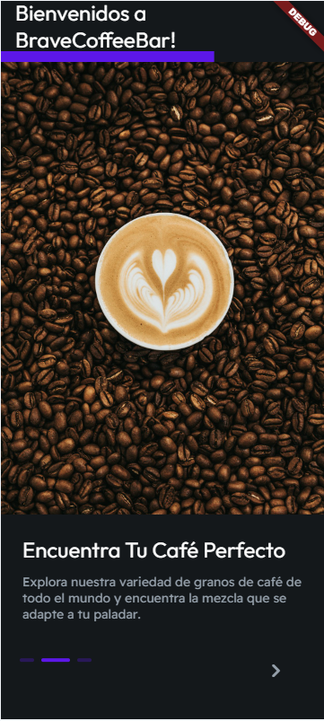
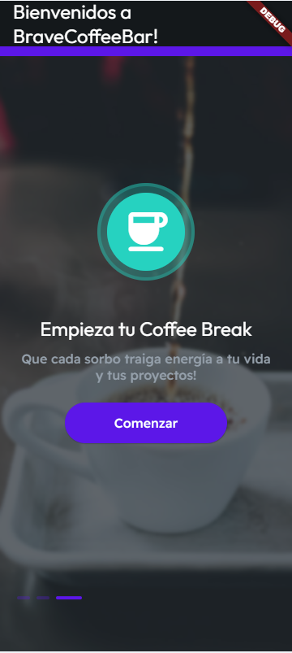
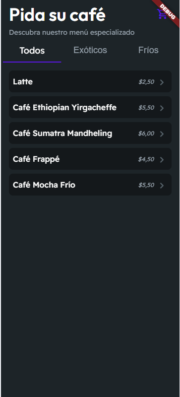
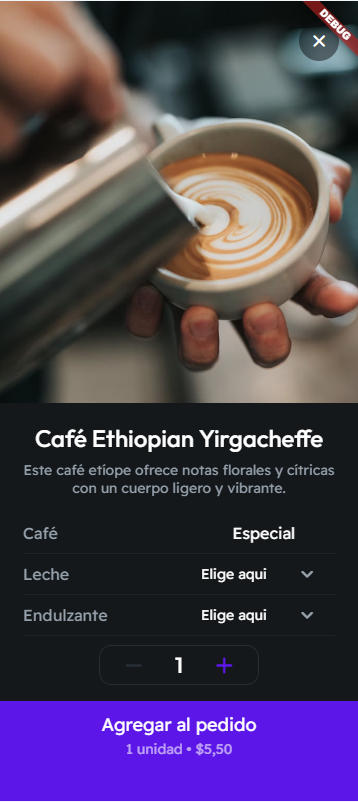
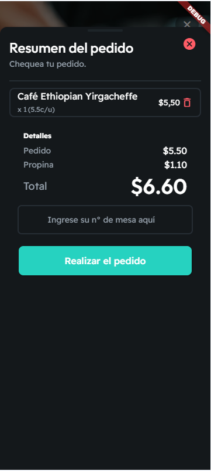
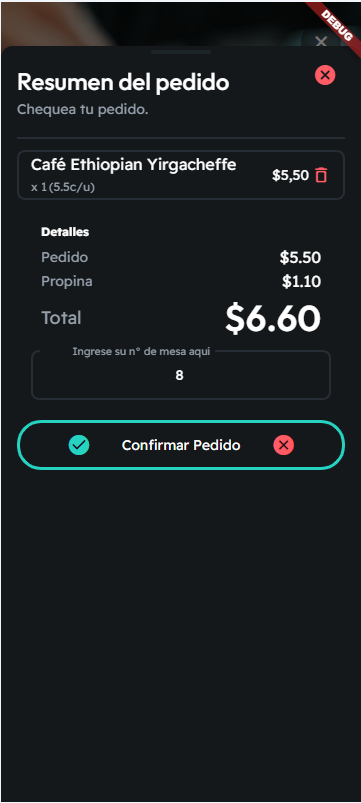
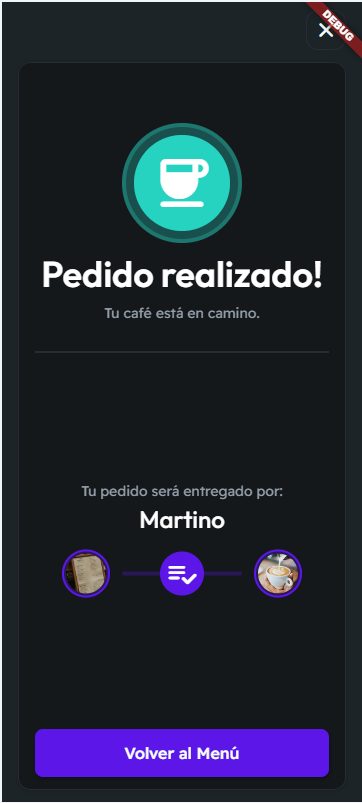
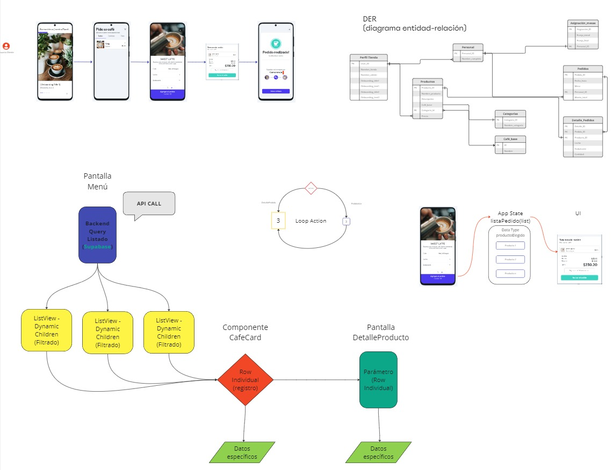

# c20-81-n-no-code  
# La documentación se encuentra en la carpeta docs/.

# Brave Coffee Bar☕️

Bienvenido a **Brave Coffee Bar**, una aplicación No Code que permite a los clientes de nuestra cafetería explorar, personalizar y ordenar una selección de cafés de todo el mundo. Acceda a la aplicación escaneando el código QR disponible en nuestras mesas y disfrute de una experiencia de pedido única y sin contacto.

## Tabla de Contenidos

- [Descripción](#descripción)
- [Características](#características)
- [Cómo Usar](#cómo-usar)
- [Tecnologías Utilizadas](#tecnologías-utilizadas)
- [Contribución](#contribución)
- [Licencia](#licencia)
- [Contacto](#contacto)

## Descripción

**Brave Coffee Bar** es una solución digital que permite a los clientes seleccionar y ordenar su café favorito directamente desde su dispositivo móvil. La aplicación ofrece una variedad de cafés nacionales e internacionales, con opciones para personalizar cada pedido según las preferencias del usuario.

## Características

- **Selección de Café:** Explora una amplia gama de cafés provenientes de diferentes países.
- **Personalización:** Personaliza tu café eligiendo opciones como con o sin leche, con o sin endulzante y sus tipos.
- **Selección de Mesa:** Indica en qué mesa te encuentras para que el mesero pueda entregarte tu pedido.
- **Confirmación de Pedido:** Recibe información detallada sobre el importe total y el mesero asignado a tu mesa.
- **Acceso Fácil:** Simplemente escanea el código QR en la mesa para comenzar.

## Capturas de pantalla

| Pantalla de Inicio  | Pantalla de Inicio 2 | Pantalla de Ingreso  | Menú Principal       |
|---------------------|----------------------|----------------------|----------------------|
|  |  |  |  |

| Elección Extra       | Resumen Pedido        | Confirmar Pedido     | Pedido Realizado     |
|----------------------|-----------------------|----------------------|----------------------|
|  |  |  |  |

## Cómo Usar

1. **Escanea el Código QR:** Encuentra el código QR en tu mesa y escanéalo con la cámara de tu teléfono para acceder a la aplicación.
2. **Explora el Menú:** Navega por la selección de cafés disponibles y elige el que prefieras.
3. **Personaliza tu Pedido:** Selecciona tus preferencias (leche, endulzante) y la cantidad de cafés.
4. **Selecciona tu Mesa:** Indica el número de la mesa donde te encuentras.
5. **Confirma tu Pedido:** Revisa los detalles de tu pedido, incluyendo el importe total y el mesero asignado.
6. **Disfruta tu Café:** Siéntate y relájate mientras el mesero lleva tu pedido a tu mesa.

## Tecnologías Utilizadas

- **Plataforma No Code:** [FlutterFlow](https://flutterflow.io/)
- **Backend y Base de Datos:** [Supabase](https://supabase.com/) (autenticación, almacenamiento y consultas SQL).
- **Diseño:** [Figma](https://www.figma.com/) (para la creación de prototipos y diseño UI/UX).
- **Generación de Códigos QR:** [qrcodemonkey](https://www.qrcode-monkey.com/es/)
- **Colaboración y Planificación:** [MIRO](https://miro.com/) (para la planificación visual y colaboración en equipo).
- **Frontend (Opcional/Futuro):** HTML5, CSS3, JavaScript (para futuras mejoras en la app).
  
## Contribución

¡Nos encantaría recibir tus contribuciones! Para contribuir:

1. Haz un fork del proyecto.
2. Crea una rama para tu funcionalidad (`git checkout -b feature/nueva-funcionalidad`).
3. Realiza tus cambios y haz commit (`git commit -m 'Añadir nueva funcionalidad'`).
4. Envía tu rama (`git push origin feature/nueva-funcionalidad`).
5. Abre un Pull Request.

## Documentación Técnica

### Diagrama Entidad-Relación (ER)

Aquí se muestra el modelo entidad-relación (ER) de la base de datos de Brave Coffee Bar:

Este modelo estructura las relaciones entre pedidos, clientes, mesas y opciones de personalización.

## Planificación de Sprints

- [Sprint 1: Diseño del Menú de Cafés](docs/Sprint-1-Plan.md)
- [Sprint 2: Confirmación de Pedido e Integración de QR Codes](docs/Sprint-2-Plan.md)
- [Sprint 3: Selección de Mesa y Optimización UX](docs/Sprint-3-Plan.md)
- [Sprint 4: Pruebas y Preparación para el Demo Day](docs/Sprint-4-Plan.md)

## Team Leader

- Elías David Galeano

## Licencia

Este proyecto está licenciado bajo la Licencia MIT. Para más detalles, consulta el archivo [LICENSE](LICENSE).

## Contacto

¿Tienes preguntas o comentarios? No dudes en contactarnos:

- Email: [angelsmart86@gmail.com](mailto:angelsmart86@gmail.com)
- Sitio web: [www.bravecoffeebar.com](http://www.bravecoffeebar.com)
- Github: [www.github.com](https://github.com/angelsmart86)
- Teléfono: [+549 266 4644093]
